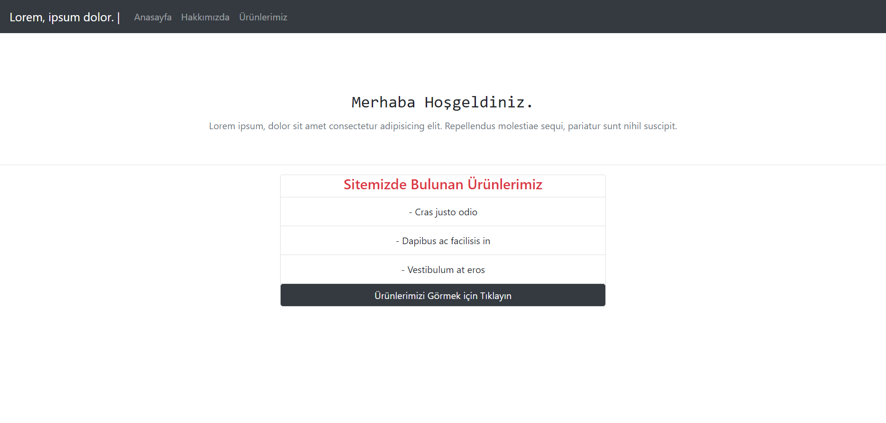
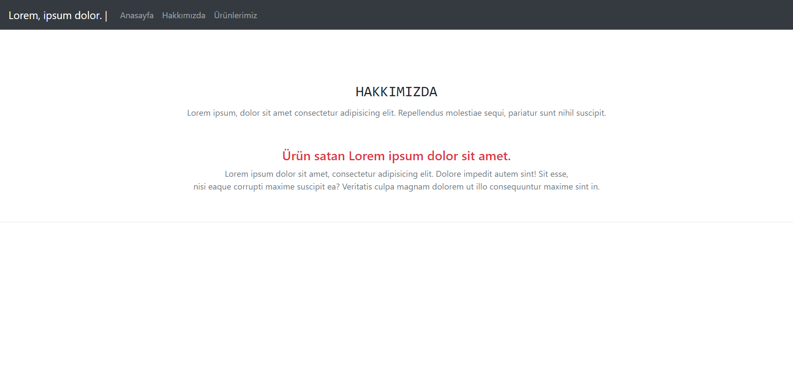
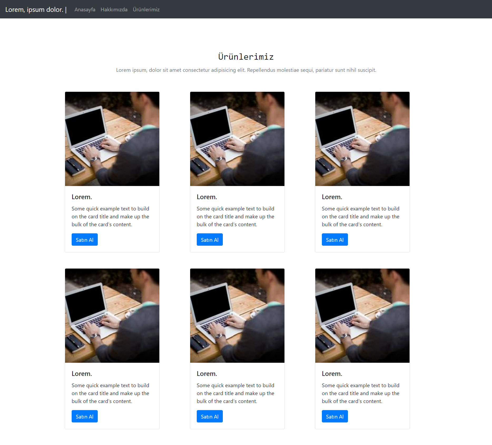

# İLK BOOTSTRAP ÇALIŞMASI
Kodluyoruz **BOOTSTRAP EĞİTİM** kapsamında yaptığım çalışma

 - Bootstrap kullanarak Ödev 1 Kısmındaki sitenin benzerini yapmaya çalıştım.
 -  index.html, about-us.html, products.html olarak 3 bölümden oluşuyor.
 - Sitenin Görünümü ; 

## ANASAYFA
İndex.html Sayfa Görünümü

## HAKKIMIZDA
about-us.html Sayfa Görünümü

## ÜRÜNLERİMİZ
products.html Sayfa Görünümü

